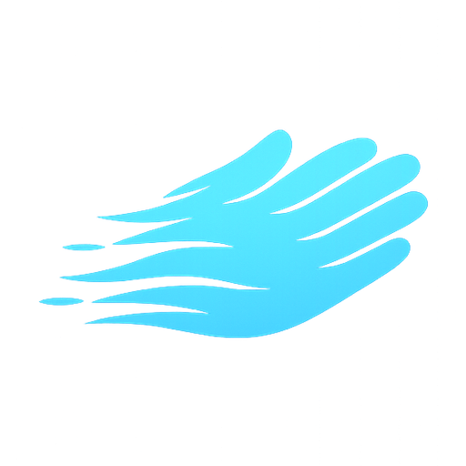

<div align="center">



# AirKeys

**Turn a webcam into an invisible mouse and keyboard.**
Your hand in the air *is* the device — no hardware, no gloves, fully offline.

*Move the cursor with your fist, click by opening your thumb, hold keys for gaming, or type letters on an empty desk.*

[](https://github.com/daniel-madrid-07/AirKeys/releases)
[](https://github.com/daniel-madrid-07/AirKeys/releases)
[](https://github.com/daniel-madrid-07/AirKeys/releases)
[](LICENSE)

</div>

---

## Downloads

| Version | Installer | Portable | Status |
|---------|-----------|----------|--------|
| **v0.9.0-beta** | [AirKeys-v0.9.0-beta-Setup.exe](https://github.com/daniel-madrid-07/AirKeys/releases/download/v0.9.0-beta/AirKeys-v0.9.0-beta-Setup.exe) | [AirKeys-v0.9.0-beta-win64.zip](https://github.com/daniel-madrid-07/AirKeys/releases/download/v0.9.0-beta/AirKeys-v0.9.0-beta-win64.zip) | Beta |

Every version, with release notes, on the [Releases page](../../releases).

---

## How it works

- **MediaPipe HandLandmarker** tracks 21 3D landmarks per hand (at half resolution for speed).
- **Mouse = optical flow.** The camera works like a giant optical mouse sensor: ~100 skin-texture points are tracked with sub-pixel Lucas–Kanade, the median of their motion drives the cursor — relative, stable and precise, with pointer acceleration and a flat-hand clutch.
- **Keyboard = home-row calibration + velocity-reversal strikes.** Press depth can't be seen by a single camera (the motion runs along the optical axis), so AirKeys avoids depth entirely: resting your hands on the desk calibrates the surface *appearance* per finger (the trick Meta's Quest surface keyboard uses), a keystroke is detected by its temporal signature — fast finger drop, hard stop, lift — and the key is decoded geometrically from where the fingertip landed on the QWERTY grid anchored to your home position. Each finger only competes for its own touch-typing columns; thumbs are space. Works untrained; an optional per-finger GRU model (metronome-guided recorder, inspired by *Typing on Any Surface*, arXiv:2309.00174) can replace the geometric decoder (`KB_DECODER`).

Everything runs locally. No internet, no accounts, no telemetry — the only optional network call is the update check in Settings, which queries this repo's GitHub releases.

## Modes

| Mode | What it does | Training needed |
|------|--------------|-----------------|
| **Mouse** | Fist moves the cursor · open **thumb** = left click · extend **index** = right click · **flat hand** = freeze | No |
| **Gaming** | Right hand = mouse. Left hand = held keys (finger down = key held, WASD/Shift/Space) | No |
| **Keyboard** | Type letters on an empty desk *(experimental)* | No — geometric decoder; training optional |

## Install

> **Windows only** (uses Win32 APIs, DirectShow and WebView2).

### Option A — Installer
Download `AirKeys-*-Setup.exe` from [Releases](../../releases) and follow the wizard (per-user, no admin). A portable `AirKeys-*-win64.zip` is also available: extract and run `AirKeys.exe`.

### Option B — From source
Python 3.11–3.13.

```bat
git clone https://github.com/daniel-madrid-07/AirKeys
cd AirKeys
install.bat
run.bat
```

A window opens with the live camera view, gesture legend and telemetry. Pick a mode, press **Start**. Enable **Real control** only when you trust the tracking. The UI is in English with a Spanish option in Settings.

CLI equivalents:

```bat
python airkeys.py              :: window UI
python airkeys.py menu         :: terminal menu
python airkeys.py mouse        :: mouse mode (test, does not control)
python airkeys.py mouse --real
python airkeys.py gaming --real
python airkeys.py check        :: verify camera + environment
```

## Camera placement

The single most important factor. A webcam on an arm/tripod, **elevated in front of you at ~45–60° looking down** at your hands covers all three modes. See **[GUIDE.md](GUIDE.md)** for placement, calibration and troubleshooting.

If the image comes out rotated or mirrored, fix it live in **Settings → Camera** (rotate / mirror / camera picker).

## Settings

Everything in `config.py` can be overridden without touching code: copy `settings.example.json` to `settings.json` next to the app. The UI edits the important ones live (sensitivity, smoothing, dead zone, acceleration, click thresholds, camera).

## Project layout

```
airkeys.py            entry point (window UI, terminal menu, commands)
config.py             all parameters (+ settings.json overrides)
src/app.py            unified engine (3 modes, one camera loop)
src/hand_tracker.py   MediaPipe -> landmarks + feature vector
src/flow_sensor.py    optical-flow motion sensor (mouse movement)
src/mouse_control.py  relative mouse, clutch, finger clicks
src/gaming.py         held finger-keys (no model)
src/keyboard_geo.py   untrained keyboard: home calibration + strike + QWERTY grid
src/tap.py            tap detection (gaming / trained model)
src/fingers.py        key -> finger mapping
src/model.py          per-finger expert model
src/train.py          training
src/record_air.py     metronome-guided recorder
src/webgui/           local Flask server + WebView2 UI (single index.html)
tools/                calibration, camera probe, smoke tests
packaging/            PyInstaller build + Inno Setup installer
```

Smoke tests (no camera needed):

```bat
python -m tools.smoke_flow
python -m tools.smoke_tap
python -m tools.smoke_fingers
python -m tools.smoke_geo
```

Build the executable:

```powershell
powershell -ExecutionPolicy Bypass -File packaging\build.ps1
```

## Beta status

Mouse and Gaming work out of the box. Keyboard mode now works untrained (geometric decoder) but is still experimental: type slowly and deliberately, and expect it to be sensitive to camera placement. Expect rough edges — issues and PRs welcome.

## License

MIT — see [LICENSE](LICENSE).
